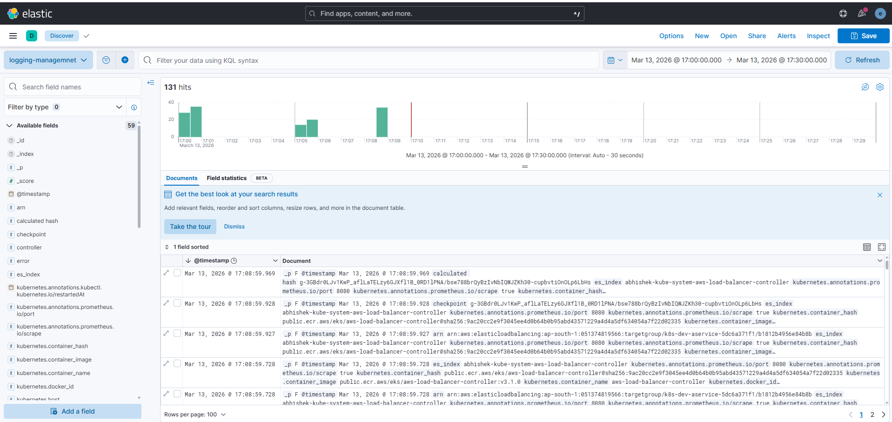
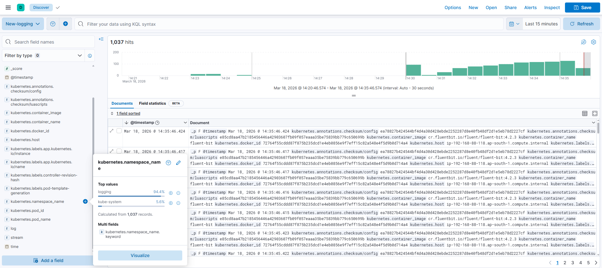

# kubernetes-efk-logging-with-nodejs

This project demonstrates how to deploy a Node.js application on AWS EKS and implement centralized logging using the EFK stack (Elasticsearch, Fluent Bit, and Kibana).

This project deploys a Node.js application on Kubernetes (AWS EKS) and collects application logs using Fluent Bit, which forwards them to Elasticsearch. Kibana is used for log visualization and analysis.
```
NodeJS App  
     │  
     ▼  
Fluent Bit (DaemonSet)  
     │  
     ▼  
Elasticsearch  
     │  
     ▼  
Kibana Dashboard 
``` 

## Tech Stack

- Node.js
- Docker
- Kubernetes
- AWS EKS
- Elasticsearch
- Fluent Bit
- Kibana
- Helm
- eksctl
- kubectl

## Prerequisites

Make sure the following tools are installed:

- AWS CLI
- kubectl
- eksctl
- Docker
- Helm
- Node.js

---

# Screenshots

## Prometheus Screenshots

## Kibana Screenshots
<table>
<tr><td></td></tr>
<tr><td></td></tr>
</table>
